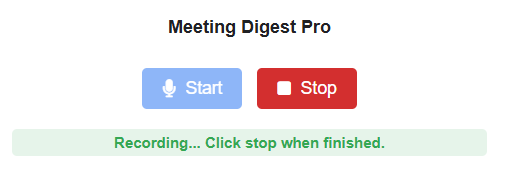
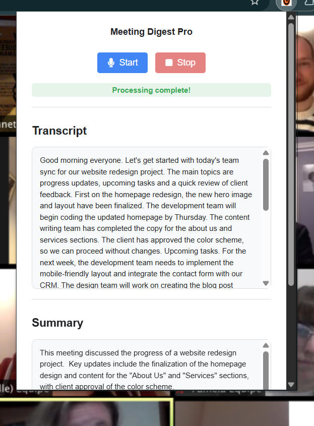
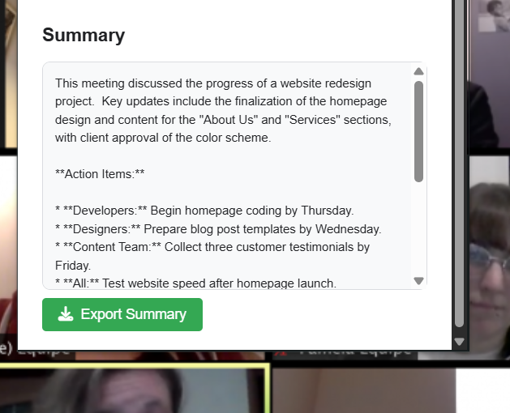

# Meeting-Digest-Pro

**Meeting Digest Pro** is a Chrome extension that records meeting audio, transcribes it, and generates a concise summary of key discussion points, action items, and decisions — all powered by the Gemini API.

---

## 🚀 Features
- 🎙️ Record meetings directly from your browser
- 📝 Accurate transcription of spoken content
- 📌 Concise summary with action items & decisions
- 💾 Export summary as `.txt`
- ⚙️ Customizable API Key via Options page
- 🔒 API key stored locally for security

---

---

## 🛠️ Installation (Developer Mode)
1. **Download ZIP** or clone this repository.
2. Open **Google Chrome** → go to `chrome://extensions/`.
3. Enable **Developer mode** (toggle at top right).
4. Click **Load unpacked** → select the `MeetingSummarizer-Final` folder.
5. The extension will now appear in your Chrome toolbar.

   

---

## 🔑 Setting Up API Key
1. Open the extension popup.
2. Go to **Options**.
3. Enter your **Google AI Studio (Gemini) API Key** (starts with `AIzaSy...`).
4. Save and verify the key.

---

## 📋 Permissions Used
- **storage** → Store API key securely
- **microphone** → Record meeting audio

---

## 📌 Requirements
- Google Chrome v110+
- Gemini API Key from [Google AI Studio](https://makersuite.google.com/)

---

## 📄 Output — Step by Step
1. **Start Recording**  
   Click **Start** in the popup to begin capturing meeting audio.  
   

2. **Recording in Progress**  
   The extension actively listens and stores the audio locally.  
   

3. **Processing Audio**  
   Once stopped, the extension sends audio to the Gemini API for transcription and summarization.  
   

4. **View the Results**  
   The popup displays both the **Transcript** and the **Summary**.  
   

5. **Download the Summary File**  
   Click **Export Summary** to download it as a `.txt` file.  
   

---

## 📜 How Output is Generated
- Audio is recorded using the **MediaRecorder API**.
- The recorded file is converted and sent to **Gemini API**.
- The API returns:
  - **## Transcription** → full meeting text
  - **## Summary** → bullet points, action items, decisions
- The summary is displayed instantly and can be downloaded as: meeting_summary_YYYY-MM-DD.txt

## 🛡️ License
MIT License — feel free to modify and use.

